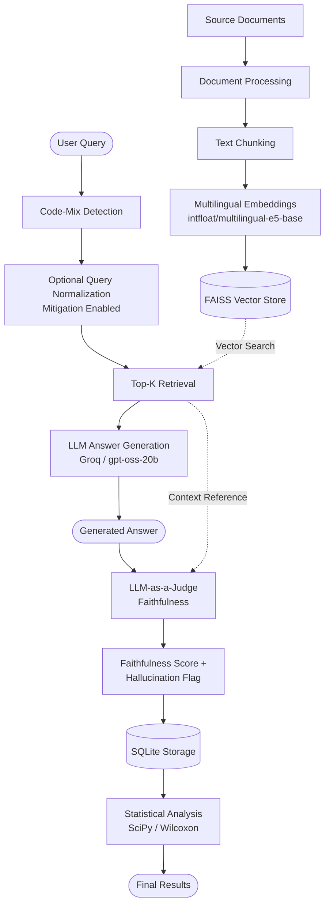

```mermaid
graph TD
    A[Source Documents] --> B[Document Processing]
    B --> C[Text Chunking]
    C --> D[Multilingual Embeddings<br>intfloat/multilingual-e5-base]
    D --> E[(FAISS Vector Store)]
    
    F([User Query]) --> G[Code-Mix Detection]
    G --> H[Optional Query Normalization<br>Mitigation Enabled]
    H --> I[Top-K Retrieval]
    E -.-> |Vector Search| I
    
    I --> J[LLM Answer Generation<br>Groq / gpt-oss-20b]
    J --> K([Generated Answer])
    K --> L[LLM-as-a-Judge<br>Faithfulness]
    I -.-> |Context Reference| L
    
    L --> M[Faithfulness Score +<br>Hallucination Flag]
    M --> N[(SQLite Storage)]
    N --> O[Statistical Analysis<br>SciPy / Wilcoxon]
    O --> P([Final Results])
```
